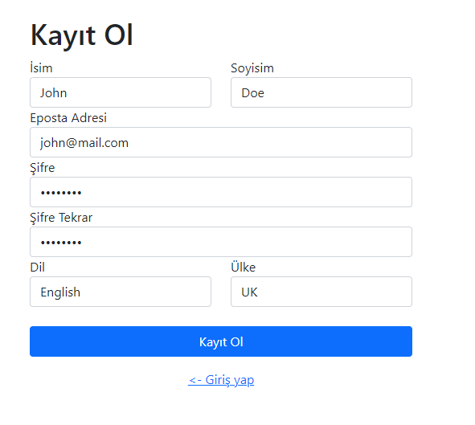
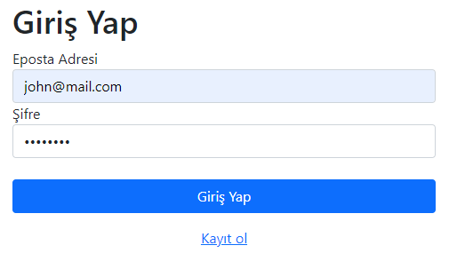
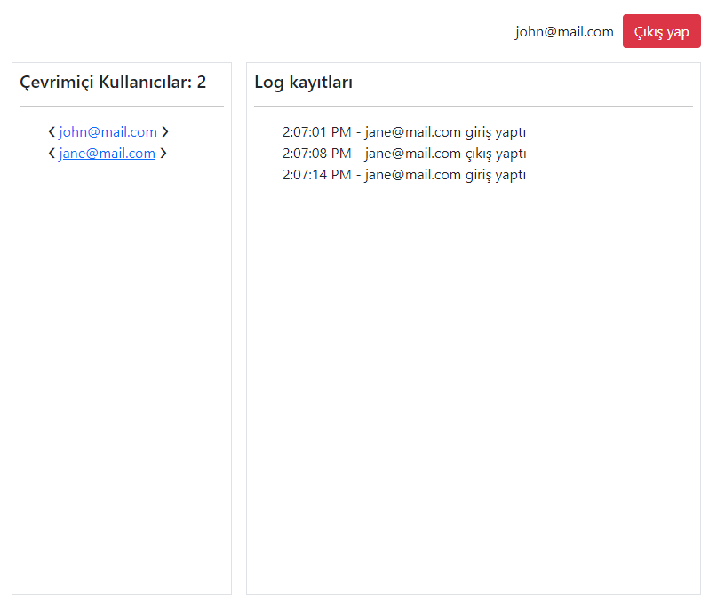
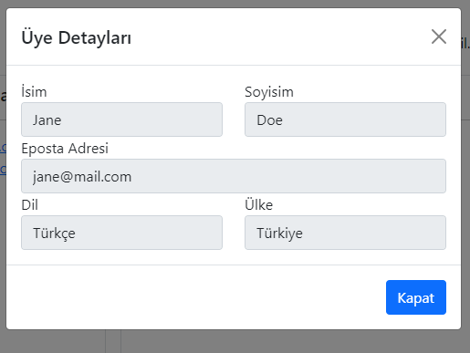

# NodeJS WebSocket Case

An example NodeJS express websocket backend with multiple nodes support (via redis and HAProxy).

## Running the Project

### Docker

Just use `docker-compose up -d --build` at the root of the repository. You can access application from
`localhost:4000/`

## Screenshoots

### Register

### Login

### App

### User Details

## License

The code in this project released under the [MIT License](LICENSE).
